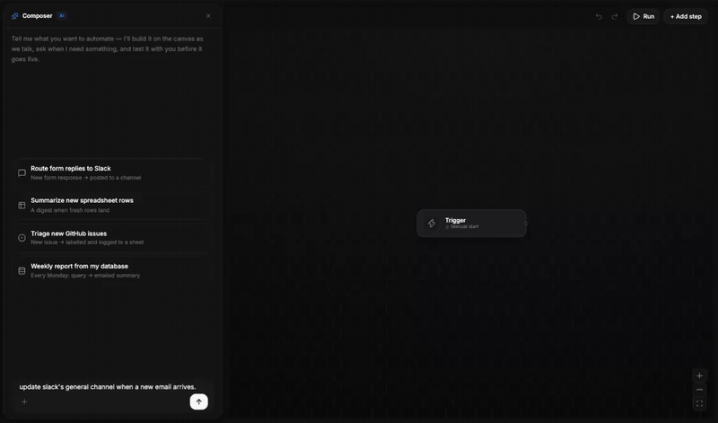

# Sarati

Build automations on a canvas. Branch, review and merge them like code. Run them on an engine that
survives a restart.



```bash
curl -fsSL https://get.sarati.io | sh
```

Open <http://localhost:8080> and create your account — the first one is the owner, everyone after joins
by invite. Docker is the only requirement, and re-running the installer keeps your keys and your data.
Rather read it first? It only fetches [`docker-compose.yaml`](docker-compose.yaml), generates this
install's secrets, and starts it. From there, [docs.sarati.io](https://docs.sarati.io) walks the
first workflow end to end.

## Why

Visual builders are quick to start and impossible to govern: one shared canvas, edited live, no diff, no
rollback. Durable engines are dependable and code-only, so nobody outside engineering can touch them.
Sarati is both.

## What it does

- **Every save is a version on a branch** — never an edit to what is running.
- **Diffs and merges at the field level inside a step**, not as text. Two people editing different
  settings on one step reconcile cleanly, and a renamed step keeps its identity.
- **Reviews and protected branches** — a protected branch takes change only through an approved review.
- **Environments** — promotion moves a pointer across staging, uat and production. Not a copy-paste.
- **Durable runs** — crash or redeploy mid-flight and runs resume instead of being orphaned.
- **Connections belong to the environment** — a step names the app it needs, the environment supplies
  the account. Staging hits the sandbox, production hits the real thing, and sharing a workflow never
  shares a credential.
- **AI on the same rails** — the composer drafts onto the canvas as ordinary versioned structure, and
  agent steps are configured in the open, so a prompt change shows up in a diff.
- **Agents work through the gate, not around it** — MCP tools let an agent open a branch and propose an
  edit, with no authority to merge or promote.

## Editions

What you self-host is the whole product. Commercial modules sit behind a boundary the build enforces —
the core may not import from them, and `pnpm check` fails if it ever does. Security and correctness are
never behind that boundary.

Licensed [fair-code](https://faircode.io) under the Sarati Sustainable Use License: source-available,
free to self-host, with limits on reselling it as a competing service. See [LICENSE.md](LICENSE.md).

## Docs

**[docs.sarati.io](https://docs.sarati.io)** — install, first workflow, branching and reviews,
triggers, connections, environments. Every instruction there was run against a live instance.

- [CONTRIBUTING.md](CONTRIBUTING.md) — running it locally, the test gate, sending a change
- [SECURITY.md](SECURITY.md) — reporting a vulnerability privately
- [AGENTS.md](AGENTS.md) — the working rules, for humans and coding agents alike
- [`apps/service/src/domain/README.md`](apps/service/src/domain/README.md) — every invariant and the
  test that guards it
- [`@sarati/actions-sdk`](https://www.npmjs.com/package/@sarati/actions-sdk) — write your own typed
  actions and triggers. MIT, and independent of this platform.
